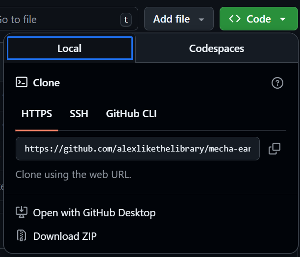
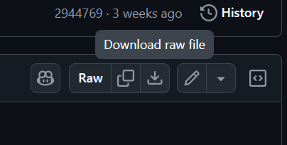
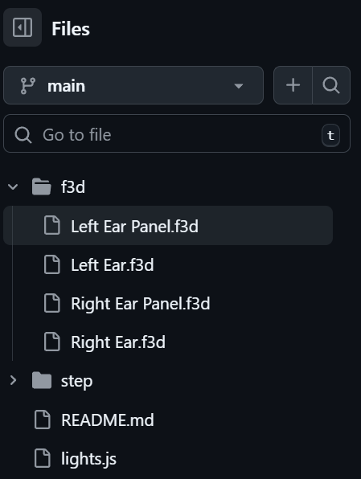

# Reactive Mecha Headphone Ears using Circuit Playground
This repository has the javascript, .uf2, .step and .f3d files needed to full recreate this project.

The video overview for this project can be found on my [Youtube](https://www.youtube.com/@alexlikethelibrary) and the specific video at [this link](https://youtu.be/mvOL9g3Npf8)!

## How to download and use files for non-Github users
3D models are split into .step and .f3d for non-fusion and fusion users. 
Downloading the Zip:
To download the full repo click on the green "<> Code" button then click on "Download ZIP"

Navigation and Individual Files:
1. Click on the _folder_ name to open up the folder (will light up blue while hovering). This will open up the files tab view
2. Click on the _file_ name to open up the file (will light up blue while hovering). Sometimes github will automatically display the file's code, if not this does not always mean the file is empty.
3. Use the download button to download the file to your computer

4. You can also navigate through files using files tab that pops up on the left of the screen

Using files:
Upload cad files to desired program or slice them in the preferred slicer.

To edit the javascript file, download and open it up using [Adafruit's Makecode](https://makecode.adafruit.com/#editor). Then download the file as a .uf2 since .js cannot be directly downloaded.

To upload directly to the Circuit Playground Express from this repo, download the lights.uf2 file and follow [this tutorial](https://makecode.adafruit.com/device/usb) from Adafruit for the device.

Also this is my first proper readme, let me know if there's any formatting issues 
